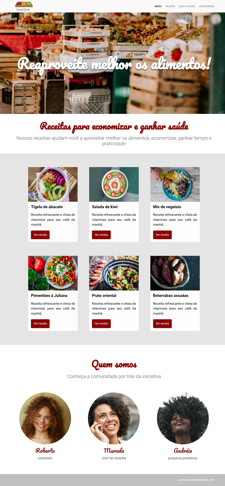

<h1 align="center">🍓 Fruta & Fruto 🍍</h1>

<h3 align="center">Projeto desenvolvido no curso de Arquitetura CSS da Alura.</h3>

 

  

## 📚 Tópicos

- [Imagem do projeto](#imagem)
- [Acesso ao projeto](#acesso)
- [Descrição do projeto](#desc)
- [Tecnologias utilizadas](#tech)
- [Status do projeto](#status)
- [Licença](#license)

 

<h2 id="imagem">🖼️ Imagem do projeto</h2>

 

<h2 id="acesso">🔗 Acesso ao projeto</h2>

Acesse o projeto clicando [aqui](https://fel1324.github.io/Fruta-e-Fruto/)

 

<h2 id="desc">✨ Descrição do projeto</h2>

O Fruta & Fruto é um site que apresenta receitas saudáveis para as pessoas que desejam aproveitar melhor os alimentos, economizar na hora de gastar, ganhar tempo e praticidade, além de mostrar receitas paras as pessoas que desejam viver uma vida mais saudável.

 

<h2 id="tech">🔥 Tecnologias utilizadas</h2>

* HTML e CSS
* Git e Github

 

<h2 id="status">🚧 Status do projeto</h2>

✔️ Projeto finalizado

 

<h2 id="license">📰 Licença</h2>

Esse projeto está sob a licença MIT.
